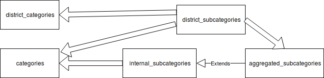

## eventstat

### Installation

#### Ruby
If not installed already, do `sudo apt-get install libmysqlclient-dev`. Next get rvm with: `gpg --keyserver hkp://keys.gnupg.net --recv-keys 409B6B1796C275462A1703113804BB82D39DC0E3` followed by `curl -sSL https://get.rvm.io | bash -s stable`. Close and reopen the terminal, then invoke `source ~/.rvm/scripts/rvm` and `rvm install 2.3` (user may need to be in sudoers list for this step). Grab bundler with `gem install bundler`, change to the app directory and do `bundle install`.

#### MySQL

To create the database, open MySQL and do `CREATE DATABASE eventstat`. Set up the user for the main script as follows: `CREATE USER 'eventstat'@'localhost' IDENTIFIED BY 'secret';` and `GRANT ALL PRIVILEGES on eventstat.* to 'eventstat'@'localhost'` Open a new terminal to `cp settings.rb.example settings.rb`, then install the database structure with `ruby db/schema.rb`

#### Logs
From the app folder, do `mkdir logs && touch logs/error.log && touch logs/eventstat.txt`

#### Web server

There are many ways to set up the server, for example as a standalone Thin server or as a Phusion Passenger. For local testing, `ruby webserver.rb` should start it on port 5100.

### GRUNNDESIGN OG BEGREPER

Eventstat ble utviklet for å dekke Deichmans behov for rapportering til intern og ekstern bruk, og strukturen ble i hovedsak avledet av rapporteringsskjemaene selv.

Ved registrering av arrangementer er to (tre hvis man er fra FUBIAK) skjemaer slått sammen til ett, og det er særlig to attributter som er viktig for at alt skal henge i hop: type og kategori.

#### Type
Hvert arrangement har én type (feks: “Arrangement I egen regi” eller “Program for klasser”), som igjen er assosiert med en hovedtype (“Arrangement” eller “Arrangement for klasser og barnehager”) og en undertype (feks “egen regi” eller “intern regi”).

#### Kategori
Kategoriene er litt mer innfløkt - kanskje særlig fordi det har vært kinkig å finne gode begreper – men vi har valgt å skille mellom hovedkategori (tenkt som et grovsortert toppnivå) og underkategori (med finere emneinndeling).

Det finnes to sett hovedkategorier: ett som tilsvarer Nbs inndelinger (“samtale/debatt”, “opplæring/kurs/verksted” osv. I databasen heter tabellen simpelthen “categories”), og ett som tilsvarer bydelens hovedinndelinger (“district_categories”).

Det finnes også to sett underkatergorier: ett som tilsvarer Deichmans interne inndelinger (“internal_subcategories”) og ett for bydelen (“district_subcategories”).

For å sy dette sammen, er det nødvendig med flere integrasjonsskjemaer (link-tabeller): Ett for å assosiere interne underkategorier med hovedkategoriene, pluss to for å knytte bydelsunderkategoriene til hhv bydels- og hovedkategorier. (Øvrige link-tabeller beskrives i eget punkt lenger ned...)

I tillegg har vi en aggregert underkategori (sekkepost) for at interne rapportkjøringer skal bli mer oversiktlige.

Det hele kan se slik ut når det strekes opp av noen som gjorde det ekstra dårlig i tegning, form og farge på grunnskolen (fete piler representerer link-tabeller):

Løsningen for bydelskategorier ble skohornet inn lenge etter at hoveddesignet var klart, og det kan ikke utelukkes at det finnes mer elegante måter å lage hierarkiet på...

#### Målgrupper
Et mye enklere attributt er aldersgrupper (“barn 0-5 år”, “barn (ungdomsskolealder”, osv.), som igjen er mappet til en alderskategori (“barn/unge” og “voksne”). Denne mappingen er løst ved en enkel enum i tabellen - et valg jeg ikke har vært særlig fornøyd med i ettertid.

### LENKING
Oversikt over de forskjellige link-tabellene:

* “district_links” binder sammen bydelskategorier og bydels-underkategorier
* “aggregated_links” knytter bydelsunderkategorier til en sekkepost i intern-underkategoriene (pt har vi bare én, kalt “Annet - FUBIAK”)
* “subcategory_links” knytter intern-underkategorier til hovedkategorier
* “event_types” brukes i registreringen og er assosiert med hovedtype og undertype.
* “age_attributes” definerer hvilke aldersgrupper som skal være valgbare for hvilke arrangementstyper i GUI’et.
* compound_query_links mapper lagrede queries til compound_queries.

Databasemodell (bemerk at internal_subcategories og district_subcategories er subklasset via ActiveRecord og følgelig ikke vises. Templates er retusjert bort ettersom det ble altfor mange piler hit og dit. Workbench-filen ligger under /documentation):

### ØVRIGE DESIGNVALG

#### Innlogging
Ettersom vi foreløpig ikke har noen SSO på Deichman, er det i nåværende løsning brukt ett felles brukernavn og passord for alle standardbrukere. For å få denne fellesløsningen til å virke smidigere er det gjort noen særtilpasninger:

* For at folk skal slippe å fylle inn sted hver gang de legger inn et nytt arrangement, kan de velge en default filial via GUI’et som lagres i local storage.
* For å unngå scenarier der bruker fra en filial sletter en annen brukers data i vanvare, har vanlige brukere ikke anledning til å slette arrangementer direkte. De kan i stedet markere dem for sletting (markerte arr. telles ikke med i statistikken og er ikke synlig i oversikten per default).

Det finnes også en innlogging for superbruker, med særskilte rettigheter som kun er tilgjengelig for ledelsen og driftsavdelingen.

#### Låsing
For at den som registrerer arrangementer skal slippe å bekymre seg for at noen klusser med allerede innlagte data, er det lagt til en mekanisme for å låse av datoperioder.

Denne låsingen medfører at arrangementer kun kan redigeres eller slettes av superbruker, og det som måtte finnes av arrangementer som er markert for sletting vil forsvinne for godt.

Ett spørsmål var om det også skulle være umulig for standardbrukere å legge til nye arrangementer for låste perioder, men dette ble ikke ansett som den beste løsningen. Det ble dog lagt til et attributt "added_after_lock", som gjør det mulig å holde oversikt over disse.

Det må også nevnes at det var et visst håp om at låsingen skulle sørge for å holde litt kustus blant brukerne, uten at dette skulle vise seg å bli noen innertier...

#### Lagrede arrangementsmaler
På grunnlag av sterk etterspørsel, er det lagt inn mulighet for å lage delvis ferdigutfylte skjemaer for arrangementer som holdes regelmessig. Det er dog ikke brukt nevneverdig, ettersom vi frykter kaoset som kan oppstå dersom brukerne står fritt til å opprette maler I vilden sky.

#### Lagrede spørringer
Vi har her enkeltspørringer ("queries") som består "query_parameters", og sammensatte spørringer ("compound_queries"), som er lenket til førstnevnte via "compound_query_links".

### NOTATER TIL BACKEND

Kodebasen er i noenlunde god stand, men den er i v1 med alt dette innebærer av mer eller mindre vellykkede eksperimenter, og som sådan moden for oppussing.

Under følger noen utvidede kommentarer til nåværende implementasjon:

#### Dataformat for statistikkresultater
I første iterasjon av statistikken, viste man alltid alle kolonnene uansett spørring, noe som førte til mye overflødig info.

Dette ble forsøkt utbedret i nåværende iterasjon, som bygget dynamiske headere for hver spørring slik at bare relevant informasjon ble presentert. Dersom brukeren kjørte flere spørringer etter hverandre, ble headerne sammenlignet og hvis de var like ble tallene aggregert, og dersom de var ulike ble de gamle tallene slettet.

Det som var planlagt for neste iterasjon, var å ha statiske headere, men legge ved et flagg som viste om de bød på relevant informasjon eller ei. Selve visningen kunne dermed være dynamisk på tvers av spørringer, og brukeren kunne evt. velge å klikke kolonnene av/på.

#### Spesialtilfelle for bydelskategorier
Feltet treat_as_category i tabellen district_categories er trolig ikke helt intuitivt, men det fungerer som følger: når FUBIAK legger inn arrangementer, velger de enten en av sine egne bydels-kategorier, eller de velger “annet”, som betyr at resten av valgmulighetene følger Deichmans standardkategorier.

### GJENSTÅENDE OPPGAVER

#### Statistikkmotor

* utvide med muligheter for uke/måned/år
* en mulig forbedring, er å legge til rette for trendvisninger – feks kjøre bestemte ukedager innenfor en periode
* en endring jeg hadde planlagt, er å la brukeren se hvilke arrangementer som skjuler seg bak tallene. En måte å gjøre dette på, er jo å slå “Oversikt” og “Statistikk” sammen til én side, feks med en switch som lar brukeren veksle mellom statistikk og arrangementsvisning.

#### Strategier for skjemaendringer
En ting nåværende kode ikke sier noe om, er hva som skal skje dersom noen av kategori-settene endres. Så lenge programmet ble utviklet og driftet lokalt, ville det jo ikke være noe å problem å løse disse tingene på ad hoc-basis, men nå som NB overtar bør man trolig hardkode de forskjellige løsningene for dette.

Disse strategiene kan også påvirke hvilke felter som trengs og ikke trengs i tabellen "events". Feks er feltet category_id redundant i dag, men avhengig av strategi kan det enten vise seg nyttig eller direkte misvisende.

#### Visningsmaler for standardrapporter
